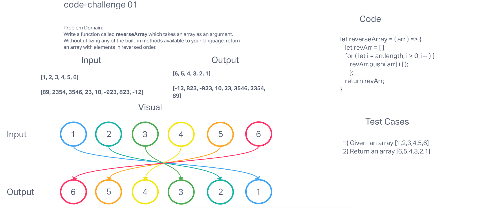

Write a function called reverseArray which takes an array as an argument. Without utilizing any of the built-in methods available to your language, return an array with elements in reversed order.

Whiteboard Process

Approach & Efficiency
This challenge was completed as a part of the class instruction. Thanks to Jacob Knaack and all of my 401 classmates.
