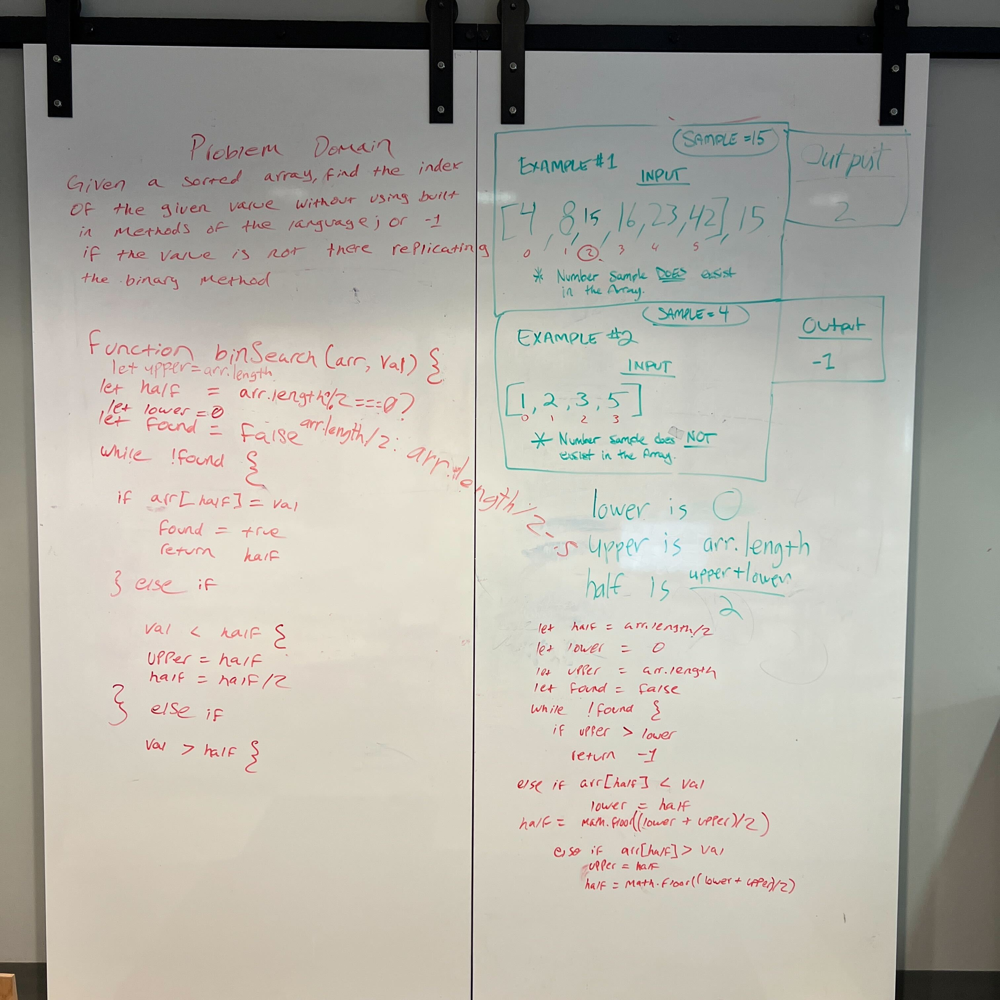

# Binary Search of Sorted Array

Given a sorted array and a search key, return the index matching the search key. If the search key isn't in the sorted array, return -1, instead. Without using built-in functions or methods, create an algorithm that does a binary search to accomplish the above task.

Whiteboard Process

## Approach & Efficiency
We wrote out the problem domain, then figure out what our inputs and outputs should be.Then we wrote out the pseudocode.

## Contributions
Worked on the whiteboard drawing with:

Jeffery Smith, Rhea Carillo, Jordan Yamada, Alfredo Ortiz, David Tusia and Robert McCreary
